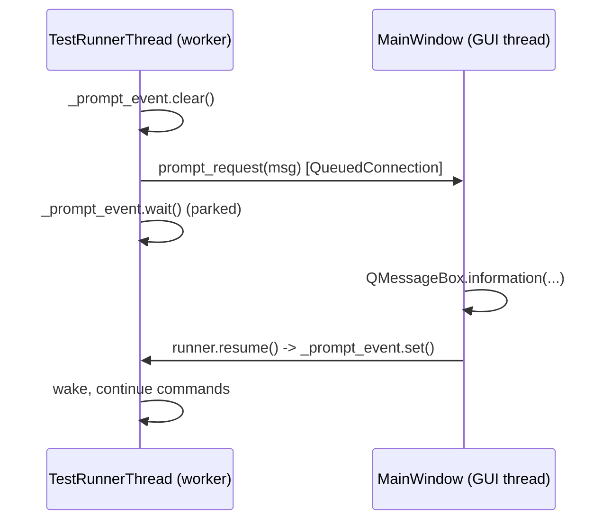
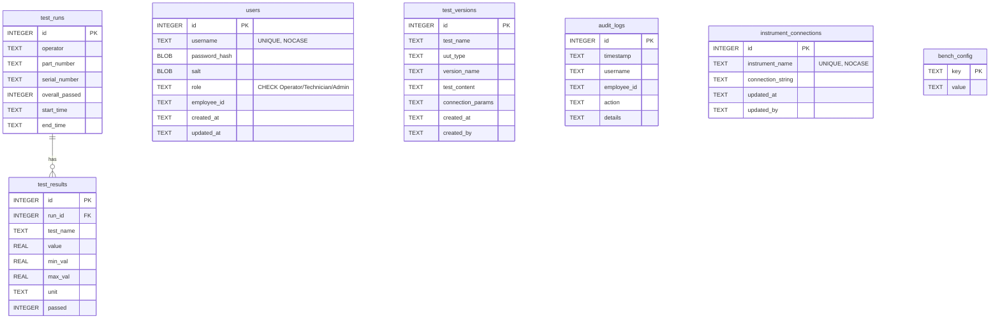
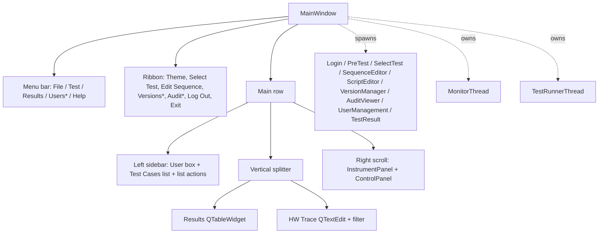

# ARCHITECTURE DEEP DIVE - The Technical Bible

This document is the canonical reference for *how* DFX_ate is built. Every
non-trivial code change must be reflected here in the same commit. If a section
contradicts the source, the source is wrong - fix the source, not the doc.

> **Audit sync (2026-06-07):** This file was rewritten by an external code audit
> after substantial drift was found. The application has grown well beyond the
> original "script runner + SQLite history" design: it now includes a test
> **version catalog**, an **audit trail**, **encrypted system logs**, **PDF/CSV
> reporting**, a **live monitor**, and a richer RBAC/UI surface. Where the code
> and prose disagreed, the prose was corrected.

---

## 0. Subsystem map

| Subsystem            | Entry class / module                        | Layer    |
| -------------------- | ------------------------------------------- | -------- |
| Test sequencing      | `TestRunnerThread` (`logic/test_engine.py`) | logic    |
| Script parsing       | `ScriptManager` (`logic/script_manager.py`) | logic    |
| Persistence + RBAC   | `DatabaseManager` (`logic/database_manager.py`) | logic |
| Encrypted logging    | `SecureLogger` (`logic/secure_logger.py`)   | logic    |
| Reporting            | `ReportGenerator` (`logic/report_generator.py`) | logic |
| Live monitor         | `MonitorThread` (`logic/monitor_engine.py`) | logic    |
| Hardware abstraction | `BaseDriver`; `BenchDriver` (`drivers/bench/`) composes per-instrument drivers (`drivers/instruments/`) and routes `.tst` commands via capability Protocols; `factory.build_bench()` builds Sim/HW from `instrument_connections` + `bench_config` | drivers |
| Composition root     | `MainWindow` (`ui/views/main_window.py`)    | ui       |
| Config loader        | `env.py` → `config.py` / `version.py`      | top-level |

---

## 1. Threading model

The central design choice is that **the GUI thread never blocks on hardware
timing**. Three `QThread` subclasses exist in total — two in `logic/` and one
in `ui/`:

1. `TestRunnerThread` (`logic/test_engine.py`) — runs the active `.tst` sequence.
2. `MonitorThread` (`logic/monitor_engine.py`) — emits simulated live readings on an interval.
3. `ReportWorker` (`ui/report_worker.py`) — builds the PDF report off the GUI thread after a run.

> Note: this means `logic/` now imports `PySide6.QtCore` in **two** files, not
> one. `DEVELOPMENT_RULES.md` Rule 1's "only `test_engine.py`" exception has been
> updated accordingly.

### 1.1 The runner

`TestRunnerThread` (`src/logic/test_engine.py`) extends `QThread`. It owns:

- a script path + the set of selected step names,
- a `ScriptManager` (parsing) and a `BaseDriver` implementation (default `MockHardware`),
- a `DatabaseManager` (persistence) and an optional `SecureLogger`,
- run metadata (operator, tester, employee id, UUT type, part/serial number,
  logical script name, start time) folded into a `TestRunRecord`,
- cooperative-control flags: `_stop_requested` (bool), a `_prompt_event`
  (`threading.Event`) for `Prompt`, and a `_pause_event` (`threading.Event`,
  *set = running*).

`run()` iterates `loop_count × selected_steps`. Per step it:

1. Waits on `_pause_event` (pause gate), checks `_stop_requested`.
2. Emits `current_test`, resets `progress_test`, logs an `Executing:` line.
3. Runs the step up to `retry_count + 1` times via `_run_step`.
4. Builds a `TestResultPayload`, emits `test_result`, appends to
   `TestRunRecord.results` (tagged with the loop number), and writes a
   `test_result` record to the secure log.
5. Updates `progress_test`/`progress_total`.
6. Honors `Critical` (abort all loops on final-attempt failure) and
   `stop_on_fail`.

In the `finally:` block it calls `self._hw.disconnect()` (swallowing any
exception), stamps `end_time`, persists the run via `DatabaseManager.save_run`
(wrapped in try/except), releases the pause gate, and lets `QThread` emit its
built-in `finished` signal.

### 1.2 Cancellation & pause

- **Cancel** is cooperative: `MainWindow.stop_tests()` → `TestRunnerThread.stop()`
  sets `_stop_requested = True` and *sets both events* so a thread parked on a
  prompt or a pause wakes, observes the flag, and exits through `finally:`
  (still saving partial results). The flag is checked at every loop boundary,
  before each step, inside the retry loop, and before each command in a step.
- **Pause** is implemented with `_pause_event`. `MainWindow` reuses the Start
  button as a Pause/Resume toggle: `pause()` clears the event, `resume_pause()`
  sets it. The runner only blocks on the gate **at step boundaries**, not
  between commands inside a step.

### 1.3 In-script `Delay`

`Delay <ms>` is runner-side: `_execute_command` services it with
`self.msleep(...)`. It never reaches `MockHardware`, and no UI code calls
`time.sleep`. (`MockHardware` itself uses `time.sleep` to simulate settling —
that is fine because it always runs on the worker thread.)

### 1.4 Prompt synchronization

`Prompt <msg>` parks the worker until the operator acknowledges a modal dialog:



`stop()` also sets `_prompt_event`, so a parked thread can be cancelled.

### 1.5 The live monitor

`MonitorThread` (`logic/monitor_engine.py`) loops every `interval_ms` (default
500), emitting `values_updated(dict)` with synthetic `V`/`A` readings.
`MainWindow` starts it when `config.SHOW_LIVE_MONITOR` is true and stops it
(`stop()` joins via `wait()`) on logout/close.

### 1.6 Thread wiring: report worker and shutdown

After a run, `MainWindow._finalize_run_reports` launches a `ReportWorker`
(if "Save as log" is enabled). The worker emits `archived(str)` or `failed(str)`;
both are connected to `append_trace`. `finished` is connected to `deleteLater`
and clears `self._report_worker`.

`MainWindow._shutdown_threads()` is the single shutdown path — it is called from
both `closeEvent` and `logout`:

1. If `TestRunnerThread` is running: call `stop()`, `wait(5000)`.
2. If `ReportWorker` is running: `wait(5000)`.
3. If `MonitorThread` is running: `stop()`.

`closeEvent` prompts the operator before aborting a live test run.

---

## 2. Data strategy

DFX_ate persists in three places, split by purpose:

| Concern                        | Backend        | Location                          |
| ------------------------------ | -------------- | --------------------------------- |
| Test sequences (authored)      | Plain text     | `data/*.tst` (seed) + DB catalog  |
| Test-version catalog & history | SQLite         | `data/database.db`                |
| Encrypted system/hardware logs | Fernet `.dat`  | `data/logs/sys_YYYYMMDD.dat`      |
| Archived reports               | PDF (+ CSV)    | `data/results/<UUT>/<Serial>/`    |
| Spec limits (legacy)           | JSON           | `data/limits.json` **(unused)**   |

### 2.1 Script engine

`ScriptManager` is the single seam for `.tst` files. `load_document()` returns a
`ScriptDocument` (`metadata` + ordered `TestStep`s); `load_script()` returns just
the steps. Grammar is in [KEYWORDS_DICTIONARY.md](KEYWORDS_DICTIONARY.md):

- A `PartNum:` line in the preamble (optionally `#`-prefixed) becomes
  `metadata["part_number"]` and auto-fills the UI part-number field.
- `:` opens a step. `Critical`, `Limits <min> <max>`, `Target <v> Tol <pct>`,
  `Unit <str>`, `Retry <n>` configure the current step (case-insensitive).
  `Limits` and `Target/Tol` are mutually exclusive; `Target/Tol` resolves to
  min/max at parse time.
- Every other non-comment line is a `{"cmd", "args"}` command. `Delay`, `Log`,
  and `Prompt` are intercepted at execution time; everything else dispatches to
  `MockHardware.execute_command`.
- The **last** measurement value in a step is compared to the step's limits. A
  step with limits but no executed measurement is logged and FAILs. A step
  without limits passes if no command raises (rendered with `-` in value/min/max).
- `Critical` aborts the whole run on final-attempt failure. Bad input raises
  `ScriptParseError(line_no, line, msg)`, which the runner catches and emits to
  the trace.

`serialize_ordered_steps()` rebuilds `.tst` text from `TestStep`s (used when the
Sequence Editor saves a new catalog version).

#### Retry semantics

A step with `Retry N` runs at most `N + 1` times. Only the **final** attempt is
reported (one `test_result`, one history row). Intermediate failures emit a
`attempt k/N+1 failed, retrying...` trace line. `Critical` is evaluated against
the final attempt.

### 2.2 SQLite schema

`DatabaseManager` (stdlib `sqlite3`) opens a fresh connection per method with
`row_factory = sqlite3.Row` and `PRAGMA foreign_keys = ON;`, and uses
**parameterized queries everywhere**. Seven tables (five core, plus the global
`instrument_connections` and `bench_config`):



- `test_versions` has `UNIQUE(test_name, version_name)` and a **live
  `ALTER TABLE` migration** that adds `connection_params` if missing (format
  `PORT|BAUD|PARITY|STOP_BITS`). This is the one place the codebase adds a
  column rather than a row (see `DEVELOPMENT_RULES.md` Rule 5).
- `instrument_connections` (global, per-instrument resource strings — COM/VISA/
  GPIB) and `bench_config` (global key/value bench wiring — `daq_relay_channel`,
  `load_slot`, `daq_channel_map`) are both created idempotently (`CREATE TABLE IF NOT EXISTS`, no
  `ALTER`). `bench_config` is a global settings table, not a per-test column
  (Rule 5); the per-version channel map stays with the test version.
- `save_run` inserts the parent run, captures `lastrowid`, then bulk-inserts
  results with `executemany` inside one `with conn:` transaction.
- `_create_tables()` (DDL + PRAGMA + idempotent admin seed) runs **on every
  `DatabaseManager()` construction**. The app constructs many of them (see audit).

### 2.3 Encrypted logging

`SecureLogger` writes one Fernet token per line to `data/logs/sys_YYYYMMDD.dat`
(append-only, guarded by a `threading.Lock`). The key is derived with PBKDF2-
HMAC-SHA256 (200k iterations, fixed salt) from `config.LOG_ENCRYPTION_PASSWORD`,
which is now sourced from the required `.env` key `LOG_ENCRYPTION_PASSWORD`.
The runner logs `trace`/`test_result` records; `DatabaseManager.log_audit_action`
mirrors `system` events. The Audit Viewer decrypts a chosen day (or an arbitrary
`.dat`) on demand. Override `LOG_ENCRYPTION_PASSWORD` in `.env` for any
meaningful confidentiality guarantee.

### 2.4 Reporting

`ReportGenerator` builds PDF (ReportLab `SimpleDocTemplate` + `LongTable`, with a
top-right `BirdLogo.png` watermark merged via PyPDF2) and CSV. Detail is
role-gated: **Admin** reports include Min/Max/Value/Unit; other roles get
Test Name + Result only. Admin PDFs are encrypted with `config.ADMIN_REPORT_PASSWORD`
(sourced from `.env`; key `ADMIN_REPORT_PASSWORD`). At end of run the report
auto-archives to `data/results/<UUT>/<Serial>/` when the (Admin-only) "Save as
log" box is checked — the build runs in `ReportWorker` (off the GUI thread).
CSV/PDF can also be exported manually from the Results menu (synchronous, on the
GUI thread, user-initiated).

---

## 3. UI composition

`MainWindow` (`ui/views/main_window.py`) is the composition root. It builds the
entire layout in Python (the checked-in `main_window.ui` is **not** used) and
owns far more than layout (see audit — it is a god object). Structure:



\* `Versions` / `Audit` ribbon buttons and the `Users` menu are Admin-only.

Dialogs are constructed with `parent=self` so the active QSS stylesheet
propagates down the tree. `ControlPanelWidget` exposes public attributes
(`btn_start`, `edit_part_number`, `chk_save_log`, `spin_loops`, …) which
`MainWindow` both reads **and mutates** (text, read-only, visibility) — tighter
coupling than the previous doc claimed.

---

## 4. Signal/slot map

All cross-thread communication uses Qt signals (auto-`QueuedConnection` across
threads). Connections are established in `MainWindow._start_test_run`:

| Signal (source)                                | Slot (destination)                              |
| ---------------------------------------------- | ----------------------------------------------- |
| `TestRunnerThread.log_msg(str)`                | `MainWindow.append_trace`                       |
| `TestRunnerThread.test_result(str, dict)`      | `MainWindow.update_results_table`               |
| `TestRunnerThread.loop_started(int, int)`      | `MainWindow._on_loop_started`                   |
| `TestRunnerThread.progress_total(int)`         | `ControlPanelWidget.progress_total.setValue`    |
| `TestRunnerThread.progress_test(int)`          | `ControlPanelWidget.progress_test.setValue`     |
| `TestRunnerThread.current_test(str)`           | `ControlPanelWidget.edit_current_test.setText`  |
| `TestRunnerThread.prompt_request(str)`         | `MainWindow._on_prompt_request`                 |
| `TestRunnerThread.script_log(str)`             | `MainWindow._on_script_log`                     |
| `TestRunnerThread.finished` (built-in)         | `MainWindow.on_tests_finished`                  |
| `MonitorThread.values_updated(dict)`           | `InstrumentPanelWidget.update_values`           |
| `ReportWorker.archived(str)`                   | `MainWindow.append_trace` (lambda)              |
| `ReportWorker.failed(str)`                     | `MainWindow.append_trace` (lambda)              |
| `ReportWorker.finished` (built-in)             | `ReportWorker.deleteLater`                      |
| `MainWindow.sequence_finished(bool)`           | `MainWindow._show_result_dialog`                |

The reverse runner→UI control path (`resume()`, `pause()`, `resume_pause()`,
`stop()`) is plain method calls from the GUI thread that set/clear the runner's
`threading.Event`s and flags — not Qt signals.

The runner emits a `dict` (not a `TestResultPayload` instance); the shape is
documented in `models.py`. `is_measurement=False` makes the table render `-`
for value/min/max.

---

## 5. Application boot flow

```mermaid
sequenceDiagram
    participant U as User
    participant M as main.py
    participant Lock as SingleInstanceLock
    participant L as LoginDialog
    participant W as MainWindow
    U->>M: launch
    M->>M: env.load_env_once() (via config import)
    M->>M: set AppUserModelID; ensure_user_data_seeded()
    M->>Lock: acquire data/app.lock
    loop until login cancelled or window closed without logout
        M->>L: exec()
        L-->>M: {role, name, username, employee_id}  (audit: "User Logged In")
        M->>W: MainWindow(user_info).show(); app.exec()
        alt logout_requested
            M->>M: loop again (switch user)
        else
            M->>M: break
        end
    end
    M->>Lock: release()
```

There is **no** `ChangePasswordDialog` and **no** `must_change_pwd` gate — the
previous boot diagram showed a flow that does not exist in the code.

---

## 6. Authentication and RBAC

### 6.1 Users table

`users` holds `username` (unique, `COLLATE NOCASE`), `password_hash` + `salt`
(PBKDF2-HMAC-SHA256, 200,000 iterations), `role`
(`CHECK(role IN ('Operator','Technician','Admin'))`), `employee_id`, and
`created_at`/`updated_at`. There is **no** `must_change_pwd` column.

On schema bootstrap an idempotent `INSERT OR IGNORE` seeds the default admin
using values from `config.DEFAULT_ADMIN_USERNAME` / `DEFAULT_ADMIN_PASSWORD` /
`DEFAULT_ADMIN_EMPLOYEE_ID`. The password is required from `.env`; non-secret
identity values keep safe defaults. Because bootstrap runs on every `DatabaseManager()` construction, the
seed is attempted repeatedly (`OR IGNORE` makes subsequent attempts a no-op). This
is seed-once behavior: changing `.env` after the DB exists does **not** update the
existing admin row.

> The three roles are **Operator / Technician / Admin**. Earlier docs (and the
> README) call the middle role "Engineer" — that name is not in the code.

### 6.2 Role gates (presentation-layer only)

- **Operator**: run only. No Min/Max columns, no trace log, no list actions, no
  script/sequence editing; runs come from the DB catalog via Select Test (temp
  `.tst`). Min/Max are hidden in UI and reports.
- **Technician**: like Operator for column visibility (Min/Max hidden in UI and
  reports), **but** can use the trace log, the test-list actions, and the
  Sequence Editor (and persist new versions).
- **Admin**: everything, plus the "Save as log" toggle, Versions manager, Audit
  viewer, User Management, and full-detail (encrypted) reports.

Database persistence is always complete — `min_val`/`max_val` are stored
regardless of role; gating is purely visual.

### 6.3 Password lifecycle (current reality)

- Login: `AuthManager.login` → `DatabaseManager.verify_login` (constant-time
  hash compare via `secrets.compare_digest`).
- Admin can create/edit/delete users and reset passwords via User Management.
- `AuthManager.validate_password_strength()` exists but is **not called
  anywhere** — there is currently no enforced password policy.
- No forced first-login password change exists.

### 6.4 Audit trail

`DatabaseManager.log_audit_action` appends an `audit_logs` row (and mirrors a
`system` event to the encrypted log) for: login, logout, test run started /
completed, version import / create / connection-param update. Wrapped in
try/except at every call site so audit failures never break the flow.

### 6.5 Single-instance protection

`main.py` acquires `SingleInstanceLock` on startup. **On Windows** the lock is
a named mutex (`CreateMutexW(None, False, "Local\\DFX_ate_singleton")`); the OS
releases it automatically when the process dies, so there is no stale-lock
problem and no liveness probe needed. If `GetLastError() == ERROR_ALREADY_EXISTS`
(183) a second instance raises `AlreadyRunningError`. **On POSIX** the original
PID-file + `os.kill(pid, 0)` path is retained.

---

## 7. Maintenance protocol

These files in `DOC/` are part of the build, not commentary on it.

- **Every code change must update the relevant `DOC/` file in the same commit.**
- New files → add to `FILE_MANIFEST.md`.
- New signals/threads → update §1 and §4.
- New tables/columns/pragmas → update §2.2 and the ER diagram.
- New keywords/commands → update `KEYWORDS_DICTIONARY.md`.
- New rules/exceptions → update `DEVELOPMENT_RULES.md`.
- New runtime/dependency requirements → update `SPECIFICATIONS.md`.

If a PR touches `src/` and not `DOC/`, justify the omission. Drift is the failure
mode this directory exists to prevent — and, as the 2026-06-07 audit found, it
had already set in.
